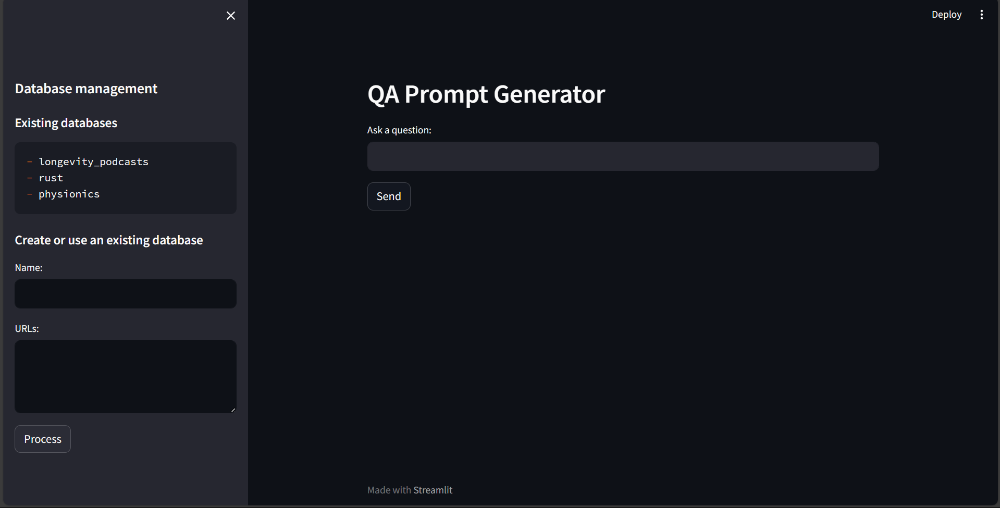

# LLM QA

An app that creates prompts for question and answering on custom content (YouTube videos and websites).

Users can create custom databases from one or multiple URLS. Simply specify a question and a target database.

The app uses Streamlit, LangChain and the open-source model 'hkunlp/instructor-xl' from Hugging Face for text analysis.

# Interface

